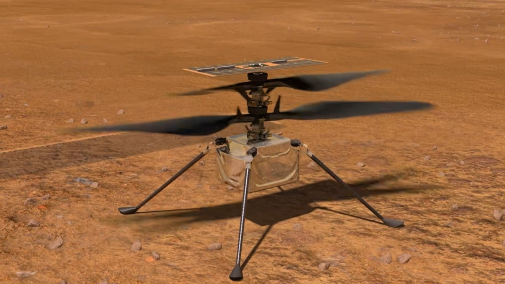

# VEHMI Recruitment Test 

Helicopters have the potential to transform Mars exploration by providing a highly mobile platform for forward reconnaissance as an aid for ground-based systems. Ingenuity is a technology demonstration to test the first powered flight on Mars, launched in July 2020 (https://mars.nasa.gov/technology/helicopter/#). 

The candidate should recreate a flight of the Ingenuity robot in the Mars environment using Unreal Engine 5 (https://www.unrealengine.com/en-US/unreal-engine-5). The deadline for this assignment is the face-to-face interview day, which will be appropriately notified in due time. During this interview the candidate will be asked to present in no more than 20 minutes all the developments made. The candidate is expected to pay attention to details; provide the highest visual accuracy as possible when compared to the real environment; a clear and documented presentation with modular and efficient algorithms; and a seamless integration of Blueprint Classes with C++ classes and the Level Blueprint. 

We allow the use of 3rd party libraries or CAD models if needed. We also encourage to provide additional inputs to the required ones below to demonstrate your software skills.

Task 1: Scene representation 
------------------------
The robot and landscape materials are expected to be changed to increase the realism of the simulation in a Mars environment. Such textures / materials can be downloaded from 3rd parties but the candidate should understand the logic behind them. See next image for reference:

Please adjust the gravity to the one expected in the Mars environment. The 2 rotor blades of ingenuity should be modelled using physics constraints in a Blueprint class for the next step.

Task 2: Control
------------------------
An interactable and movable reference (i.e. with the keyboard or the mouse) should be included to represent the target position (X,Y,Z) and orientation (eulerX, eulerY, eulerZ) of ingenuity in a given localization in the sky. Ingenuity should move (position and orientation) using a proportional controller (P) to reach that given target in the sky. The target should be able to be moved during runtime. Please assume a delay in the communications between the target and the current state of Ingenuity of 1 second. Please develop this algorithm using a C++ class and then include it as a Blueprint module. The rest of logics are expected to be solved using Blueprints only.

The robot blades of ingenuity should move as a contra-rotating, co-axial motor system and proportional to the value of P (with a maximum value of 2800rpm).

Task 3: Synthetic Data Generation
------------------------
Please include the navigation camera in the appropriate module of Ingenuity and export a video imitating as much as possible the real footage from the following video: https://youtu.be/thk4Rha-fTk

The user should be able to swipe between the 3rd person view and the camera view during runtime.

(Optional) Other ideas
------------------------

It would be interesting to provide winds that affect the navigation of Ingenuity during the flight.

Ingenuity's batteries are powered based on the availability of sunlight and have limited resources...

Ingenuity's flight dynamics do not need to be included in the simulation but it is considered as a very interesting asset if provided.
